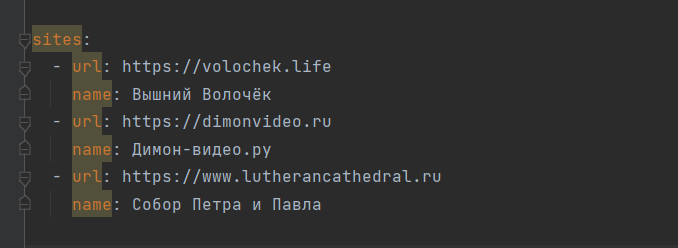
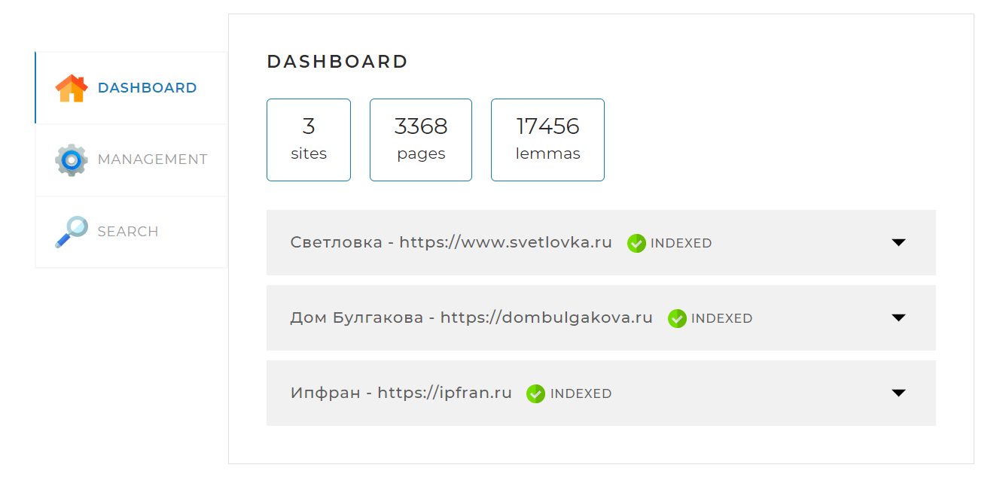

# Search Engine

Это проект поискового движка, который парсит, 
разбивает на леммы, 
индексирует в базу данных MySQL контент трёх, 
заранее определенных сайтов 
и предоставляет возможность поиска по тексту на этих сайтах.

## Настройка и запуск

Предусмотрена возможность заранее задать сайты, 
с которыми будет работать приложение. Это можно сделать в
application.yaml, установив соответствующие значения 
параметров.

Для запуска приложения используйте команду java -jar 
*{pathToSearchEngine.jar}/SearchEngine.jar* либо запустите
проект через IDE. 

## Описание интерфейса и инструкции

После запуска на порту 8080 будет доступен 
интерфейс приложения. 

Он представляет из себя 3 вкладки для управления поисковым
движком.

### Информация о проиндексированных сайтах

**На вкладеке DASHBOARD** видна информация о статусе 
индексации каждого сайта. Всего есть три статуса индексации:

- INDEXED (проиндексирован успешно)
- INDEXING (в процессе индексации)
- FAILED (индексация превана с ошибкой либо остановлена
пользователем)

По каждому сайту в раскрывающемся списке доступна информация
о количестве проиндексированных страниц, лемм и ошибках, которые возникли
при индексации (если такие были).

### Управление индексацией

**На вкладке MANAGEMENT** имеется возможность запустить индексацию всех 
сайтов сразу, либо одного из сайтов по выбору.
При запуске индексации всех сайтов (всех сразу, либо одного по выбору) 
данные индексов стираются из базы 
данных полностью и в процессе индексации записываются заново.

Имеется возможность остановить индексацию если она запущена. 
При нажатии на кнопку STOP INDEXING индексация завершится. На 
вкладке DASHBOARD будет отражен статус FAILED и соответсвующее
сообщение. Весь прогресс индексации к моменту остановки будет сохранен
в базе данных.

### Поиск

**На вкладке SEARCH** можно выполнить поиск введя поисковый запрос и 
выбрав в выпадающем списке интересующий сайт. Если сайт не выбран то 
поиск будет осуществлен по всем сайтам сразу.

Поисковая выдача содержит страницы сайтов, на которых было найдено 
соответствие поисковому запросу. Она представляет из себя 
набор сниппетов, в порядке убывания релевантности.

## Использованные технологии

- JAVA 17
- Maven
- SpringBoot 2.7.4
- MySQL 5
- Thymeleaf
- JSOUP
- Lucene Morphology
- Log4j

## Список планируемых модификаций

- Рефакторинг написанного кода
- Тестирование с помощью JUnit 5 и Mockito
- Добавление количества индексируемых сайтов, 
возможность пользовательского изменения списка сайтов
- Работа с базой данных через JDBCTemplate

 

